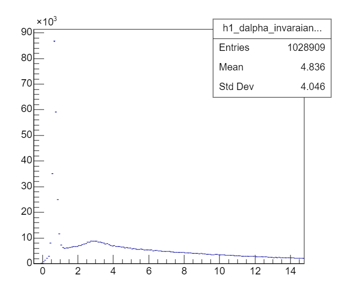

# analysis-e03045

The goal of these macros is to convert the original root files, which contains event class, to a simpler structure with arrays of momentum, energy, etc... The reason for this conversion is that one has to write the HiRAEvent and HiRAParticle class, which is clean but has to be compiled with ROOT (see below). For a simpler tree structure one can compile by simply
```bash
g++ main.cpp -o main -I`root-config --libs --cflags
```
and can be directly fed to RDataFrame !

#### 1. How to use the macro
For now, to convert the data to a structure such that for each event
- double mEtrans, ...
- int Z[multi]
- energy[multi]

```bash
root load.C read.cpp(\"${input_file}\", \"${output_file}\")
```

To run through all files, do 
```bash
python main.py
```

#### 2. Reproduce the problem
- Run
```bash
root load.C a.C
```
For some file, it produces an error :
```bash
Error in <TBasket::ReadBasketBuffers>: fNbytes = 15025, fKeylen = 93, fObjlen = 22184, noutot = 0, nout=0, nin=14932, nbuf=22184
```


A list of corrupted files are written in **del.sh**.


#### 3. d-alpha $M_{inv}$
